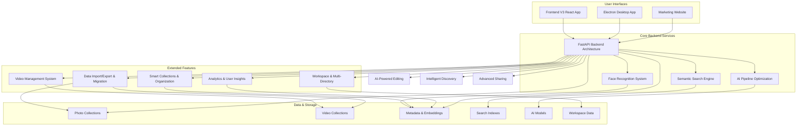

# Photo Management Application - Comprehensive Specification Suite

## Overview

This directory contains a comprehensive suite of feature-specific specifications for building a **local-first desktop photo management application** with optional AI enhancements. Each specification focuses on a specific domain while ensuring seamless integration across the entire system.

## Architecture Priority

**Photo Search follows a local-first architecture with three operational modes:**

1. **🖥️ Desktop Local App (Primary)** - Standalone Electron application
   - Direct file system access without any server requirements
   - Local thumbnail generation and caching
   - Basic photo organization and management
   - Works completely offline

2. **🤖 AI Enhanced Mode (Secondary)** - Desktop app + optional backend
   - All local features PLUS AI-powered semantic search
   - Face recognition and people management  
   - OCR text extraction and advanced search
   - Backend server provides AI processing

3. **🌐 Web App Mode (Tertiary)** - Browser-based development/testing
   - Requires backend server to be running
   - Limited to web-based file access
   - Primarily for development and testing purposes

## Specification Architecture

The specifications are organized into focused domains that collectively define the complete photo management ecosystem:

### Core Application Specifications

#### 1. **Semantic Search Engine** (`semantic-search-engine/`)
- **Focus**: AI-powered natural language photo search
- **Key Features**: Multi-modal search, vector indexing, query understanding
- **Backend Integration**: ANN managers, embedding providers, search orchestration
- **Frontend Integration**: Search interface, real-time suggestions, result visualization

#### 2. **Face Recognition System** (`face-recognition-system/`)
- **Focus**: People identification and organization
- **Key Features**: Face detection, clustering, privacy controls, people management
- **Backend Integration**: InsightFace models, face managers, biometric data handling
- **Frontend Integration**: People gallery, face tagging interface, privacy controls

#### 3. **Backend API Architecture** (`backend-api-architecture/`)
- **Focus**: Comprehensive FastAPI backend modernization
- **Key Features**: 25+ routers, AI orchestration, data management, performance optimization
- **Current State**: Extensive existing implementation requiring documentation and enhancement
- **Integration Points**: All frontend and AI processing components

#### 4. **Frontend V3 Application** (`frontend-v3-application/`)
- **Focus**: Modern React-based user interface
- **Key Features**: React 18, TypeScript, shadcn/ui, responsive design, performance optimization
- **Backend Integration**: Comprehensive API client, real-time updates, offline capabilities
- **User Experience**: Intuitive photo management, advanced search interface, accessibility

#### 5. **Desktop Electron Integration** (`desktop-electron-integration/`)
- **Focus**: Native desktop application wrapper
- **Key Features**: File system access, offline operation, OS integration, security
- **Platform Support**: macOS, Windows, Linux with native installers
- **AI Integration**: Bundled local models, offline-first architecture

### Business and Marketing Specifications

#### 6. **Landing Page and Marketing** (`landing-page-marketing/`)
- **Focus**: Customer acquisition and business growth
- **Key Features**: Conversion optimization, pricing strategy, content marketing, SEO
- **Business Integration**: Lead generation, customer onboarding, analytics
- **Revenue Model**: Subscription management, enterprise sales, trial conversions

### Technical Infrastructure Specifications

#### 7. **AI Pipeline Optimization** (`ai-pipeline-optimization/`)
- **Focus**: Advanced AI processing and model management
- **Key Features**: Multi-model coordination, performance optimization, quality assurance
- **Model Support**: CLIP, InsightFace, OCR, captioning models
- **Integration**: Seamless integration with all application components

### Extended Feature Specifications

#### 8. **Video Management System** (`video-management-system/`)
- **Focus**: Comprehensive video file handling and organization
- **Key Features**: Video indexing, thumbnail generation, content analysis, playback integration
- **Backend Integration**: Video processing adapters, metadata extraction, search integration
- **Frontend Integration**: Video grid, playback controls, video-specific organization

#### 9. **Smart Collections and Organization** (`smart-collections-organization/`)
- **Focus**: Advanced rule-based photo organization and automation
- **Key Features**: Complex rule engines, content clustering, temporal/geographic organization
- **Backend Integration**: Enhanced smart collections service, rule evaluation, automation
- **Frontend Integration**: Rule builder interface, collection management, organization insights

#### 10. **Workspace and Multi-Directory Management** (`workspace-multi-directory/`)
- **Focus**: Managing multiple photo collections and project-based workflows
- **Key Features**: Multi-directory support, project organization, workspace templates
- **Backend Integration**: Workspace persistence, directory monitoring, cross-workspace search
- **Frontend Integration**: Workspace switcher, project management interface, unified navigation

#### 11. **Analytics and User Insights** (`analytics-user-insights/`)
- **Focus**: User-facing analytics and collection insights
- **Key Features**: Collection statistics, usage patterns, content analysis, predictive analytics
- **Backend Integration**: Analytics processing, data aggregation, privacy-preserving computation
- **Frontend Integration**: Analytics dashboard, insights visualization, actionable recommendations

#### 12. **Data Import/Export and Migration** (`data-import-export-migration/`)
- **Focus**: Comprehensive data portability and system migration
- **Key Features**: Multi-system compatibility, metadata preservation, cloud integration, validation
- **Backend Integration**: Import/export processors, format converters, validation systems
- **Frontend Integration**: Migration wizards, progress tracking, validation reports

### Cutting-Edge AI and User Experience Specifications

#### 13. **AI-Powered Editing and Enhancement** (`ai-powered-editing-enhancement/`)
- **Focus**: Advanced AI-driven photo editing and enhancement capabilities
- **Key Features**: Auto-enhancement, object removal, portrait enhancement, background replacement, style transfer
- **AI Integration**: State-of-the-art AI models, real-time processing, quality validation
- **User Experience**: Interactive editing, batch processing, real-time preview

#### 14. **Intelligent Content Discovery** (`intelligent-content-discovery/`)
- **Focus**: AI-powered content discovery and serendipitous photo exploration
- **Key Features**: Memory surfacing, story creation, trend analysis, mood discovery, personalized recommendations
- **AI Integration**: Pattern recognition, behavioral analysis, contextual understanding
- **User Experience**: Discovery feeds, story timelines, trend visualizations, personalized insights

#### 15. **Advanced Sharing and Collaboration** (`advanced-sharing-collaboration/`)
- **Focus**: Modern sharing, real-time collaboration, and social integration
- **Key Features**: Intelligent sharing suggestions, real-time collaboration, professional portfolios, enterprise workflows
- **Integration**: Social media platforms, enterprise systems, collaborative tools
- **User Experience**: Interactive storytelling, collaborative curation, advanced analytics

## System Architecture Overview

## Development Priorities

### Phase 1: Local-First Foundation (Months 1-2)
1. **Desktop Electron Integration** - Primary local-first desktop application
2. **Frontend V3 Application** - React interface with direct file system access
3. **Local Photo Management** - File browsing, thumbnails, basic organization

### Phase 2: AI Enhancement Layer (Months 2-3)
1. **Backend API Architecture** - Optional FastAPI backend for AI features
2. **Semantic Search Engine** - AI-powered search when backend available
3. **Face Recognition System** - People management with AI processing

### Phase 3: Advanced Features (Months 3-4)
1. **AI Pipeline Optimization** - Enhanced AI processing and model management
2. **Landing Page and Marketing** - Business growth and customer acquisition
3. **Extended Features** - Video management, smart collections, analytics

## Key Integration Points

### Frontend ↔ Backend Integration
- **API Client**: Comprehensive TypeScript client for all backend services
- **Real-time Updates**: WebSocket integration for live processing updates
- **Offline Capabilities**: Service worker caching and offline-first design
- **Error Handling**: Graceful error recovery and user feedback

### AI ↔ Application Integration
- **Search Integration**: Semantic search embedded throughout the interface
- **Face Recognition**: People-based organization and search
- **Content Analysis**: OCR and captioning enhancing searchability
- **Performance**: Background processing with progress indicators

### Desktop ↔ Web Integration
- **Shared Codebase**: React app runs in both web and Electron contexts
- **Native Features**: File system access, OS integration, offline models
- **Security**: Context isolation and secure IPC communication
- **Updates**: Automatic updates and cross-platform compatibility

## Technology Stack Summary

### Frontend Technologies
- **Framework**: React 18 with TypeScript
- **Build Tool**: Vite for fast development and optimized builds
- **UI Library**: shadcn/ui with Radix UI primitives
- **Styling**: Tailwind CSS with responsive design
- **State Management**: Zustand for efficient state handling
- **Desktop**: Electron with security best practices

### Backend Technologies
- **API Framework**: FastAPI with comprehensive router architecture
- **AI Models**: CLIP, InsightFace, OCR engines (local and cloud)
- **Search**: Multiple ANN implementations (FAISS, HNSW, Annoy)
- **Storage**: SQLite/file-based with optimized indexing
- **Processing**: Background job queues and real-time processing

### Infrastructure Technologies
- **Deployment**: Docker containers with orchestration
- **Monitoring**: Comprehensive analytics and performance tracking
- **Security**: End-to-end encryption and privacy controls
- **Scaling**: Horizontal scaling and load balancing

## Success Metrics

### Technical Metrics
- **Performance**: Sub-500ms search response times for 50k+ photo libraries
- **Accuracy**: 95%+ face recognition accuracy, 90%+ semantic search relevance
- **Reliability**: 99.9% uptime with graceful error handling
- **Scalability**: Support for 100k+ photo libraries with linear performance

### Business Metrics
- **Conversion**: 15%+ trial-to-paid conversion rate
- **Retention**: 80%+ monthly active user retention
- **Growth**: 20%+ month-over-month user growth
- **Satisfaction**: 4.5+ star average rating across platforms

### User Experience Metrics
- **Onboarding**: 80%+ completion rate for initial setup
- **Engagement**: 70%+ daily active users among monthly users
- **Feature Adoption**: 60%+ adoption of advanced features
- **Support**: <24 hour average response time for support requests

## Getting Started

Each specification directory contains:
- **requirements.md**: Detailed user stories and acceptance criteria
- **design.md**: Technical architecture and implementation approach
- **tasks.md**: Actionable implementation tasks and priorities

To begin implementation:
1. Review the **Backend API Architecture** spec to understand existing capabilities
2. Start with **Frontend V3 Application** for immediate user value
3. Enhance **AI Pipeline Optimization** for improved intelligence
4. Implement **Desktop Electron Integration** for native experience
5. Build **Landing Page and Marketing** for business growth

## Contributing

When working on any specification:
1. Ensure cross-spec compatibility and integration
2. Maintain consistency with the overall architecture
3. Consider performance implications for large photo libraries
4. Prioritize user privacy and offline-first operation
5. Document all changes and architectural decisions

This comprehensive specification suite provides the foundation for building a world-class photo management application that combines cutting-edge AI technology with exceptional user experience and strong business fundamentals.