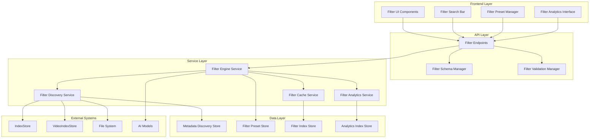

# Advanced Filtering System Design

## Overview

The Advanced Filtering System provides comprehensive photo search and filtering capabilities by leveraging the existing FastAPI backend infrastructure and extending it with enhanced metadata discovery, standardized filter interfaces, and intelligent filter management. The system builds upon the current `SearchFilterManager`, `IndexStore`, and search models to create a unified, extensible filtering architecture.

## Architecture

### High-Level Architecture



### Component Responsibilities

- **Filter Engine Service**: Core filtering logic, query execution, and result processing
- **Filter Discovery Service**: Automatic metadata discovery and filter schema generation
- **Filter Schema Manager**: Dynamic filter type management and validation rules
- **Filter Cache Service**: Performance optimization through intelligent caching
- **Filter Analytics Service**: Usage tracking, performance monitoring, and optimization suggestions

## Components and Interfaces

### 1. Enhanced Filter Models

#### Base Filter Schema
```python
from typing import Any, Dict, List, Optional, Union, Literal
from pydantic import BaseModel, Field
from datetime import datetime
from enum import Enum

class FilterOperator(str, Enum):
    EQUALS = "equals"
    NOT_EQUALS = "not_equals"
    CONTAINS = "contains"
    NOT_CONTAINS = "not_contains"
    STARTS_WITH = "starts_with"
    ENDS_WITH = "ends_with"
    GREATER_THAN = "gt"
    GREATER_EQUAL = "gte"
    LESS_THAN = "lt"
    LESS_EQUAL = "lte"
    BETWEEN = "between"
    IN = "in"
    NOT_IN = "not_in"
    EXISTS = "exists"
    NOT_EXISTS = "not_exists"
    REGEX = "regex"

class FilterDataType(str, Enum):
    STRING = "string"
    NUMBER = "number"
    BOOLEAN = "boolean"
    DATE = "date"
    ARRAY = "array"
    OBJECT = "object"

class FilterCondition(BaseModel):
    field: str = Field(..., description="Metadata field path (e.g., 'exif.camera', 'ai.tags')")
    operator: FilterOperator = Field(..., description="Comparison operator")
    value: Union[str, int, float, bool, List[Any], Dict[str, Any]] = Field(..., description="Filter value")
    data_type: FilterDataType = Field(..., description="Expected data type")
    case_sensitive: bool = Field(default=False, description="Case sensitivity for string operations")
    boost: Optional[float] = Field(default=None, description="Relevance boost factor")

class FilterGroup(BaseModel):
    conditions: List[Union[FilterCondition, "FilterGroup"]] = Field(..., description="Filter conditions or nested groups")
    logical_operator: Literal["AND", "OR"] = Field(default="AND", description="Logical operator for combining conditions")
    negate: bool = Field(default=False, description="Negate the entire group")

class AdvancedSearchFilters(BaseModel):
    # Core filters
    query: Optional[str] = Field(default=None, description="Text search query")
    
    # Metadata filters
    metadata: Optional[FilterGroup] = Field(default=None, description="Metadata-based filters")
    
    # EXIF filters
    exif: Optional[FilterGroup] = Field(default=None, description="EXIF-based filters")
    
    # AI-generated content filters
    ai_content: Optional[FilterGroup] = Field(default=None, description="AI content filters")
    
    # User-defined filters
    user_data: Optional[FilterGroup] = Field(default=None, description="User metadata filters")
    
    # Temporal filters
    temporal: Optional[FilterGroup] = Field(default=None, description="Date/time filters")
    
    # Spatial filters
    spatial: Optional[FilterGroup] = Field(default=None, description="Location/GPS filters")
    
    # File system filters
    filesystem: Optional[FilterGroup] = Field(default=None, description="File system attribute filters")
```

#### Filter Schema Discovery
```python
class FilterFieldSchema(BaseModel):
    field_path: str = Field(..., description="Dot-notation field path")
    display_name: str = Field(..., description="Human-readable field name")
    data_type: FilterDataType = Field(..., description="Field data type")
    supported_operators: List[FilterOperator] = Field(..., description="Supported filter operators")
    value_range: Optional[Dict[str, Any]] = Field(default=None, description="Min/max values for numeric fields")
    enum_values: Optional[List[str]] = Field(default=None, description="Possible values for enum fields")
    sample_values: List[Any] = Field(default_factory=list, description="Sample values from current library")
    usage_frequency: float = Field(default=0.0, description="Frequency of non-null values (0-1)")
    category: str = Field(..., description="Filter category (exif, ai, user, etc.)")
    description: Optional[str] = Field(default=None, description="Field description")

class FilterSchemaResponse(BaseModel):
    available_fields: List[FilterFieldSchema] = Field(..., description="All discoverable filter fields")
    categories: Dict[str, List[str]] = Field(..., description="Fields grouped by category")
    statistics: Dict[str, Any] = Field(..., description="Library-wide filter statistics")
    last_updated: datetime = Field(..., description="Schema last update timestamp")
```

### 2. Filter Discovery Service

```python
class FilterDiscoveryService:
    """Automatically discovers and catalogs filterable metadata from photo libraries."""
    
    def __init__(self, index_store: IndexStore):
        self.store = index_store
        self.schema_cache = {}
        
    async def discover_filter_schema(self, directory: str, force_refresh: bool = False) -> FilterSchemaResponse:
        """Discover all filterable fields in the photo library."""
        
    async def analyze_metadata_field(self, field_path: str, sample_size: int = 1000) -> FilterFieldSchema:
        """Analyze a specific metadata field to determine its characteristics."""
        
    async def get_field_value_distribution(self, field_path: str) -> Dict[str, int]:
        """Get value distribution for a specific field."""
        
    async def suggest_filter_combinations(self, current_filters: AdvancedSearchFilters) -> List[Dict[str, Any]]:
        """Suggest additional filters based on current selection and library content."""
```

### 3. Enhanced Filter Engine

```python
class AdvancedFilterEngine:
    """Core filtering engine with support for complex queries and performance optimization."""
    
    def __init__(self, index_store: IndexStore, cache_service: FilterCacheService):
        self.store = index_store
        self.cache = cache_service
        self.discovery = FilterDiscoveryService(index_store)
        
    async def execute_filters(self, 
                            filters: AdvancedSearchFilters, 
                            directory: str,
                            limit: int = 50,
                            offset: int = 0) -> FilteredSearchResponse:
        """Execute comprehensive filtering with performance optimization."""
        
    async def validate_filters(self, filters: AdvancedSearchFilters) -> FilterValidationResult:
        """Validate filter syntax and logic before execution."""
        
    async def estimate_result_count(self, filters: AdvancedSearchFilters, directory: str) -> int:
        """Estimate result count without full execution."""
        
    async def optimize_filter_order(self, filters: AdvancedSearchFilters) -> AdvancedSearchFilters:
        """Reorder filters for optimal execution performance."""
```

### 4. Filter Preset Management

```python
class FilterPreset(BaseModel):
    id: str = Field(..., description="Unique preset identifier")
    name: str = Field(..., description="User-defined preset name")
    description: Optional[str] = Field(default=None, description="Preset description")
    filters: AdvancedSearchFilters = Field(..., description="Complete filter configuration")
    tags: List[str] = Field(default_factory=list, description="Preset tags for organization")
    created_at: datetime = Field(..., description="Creation timestamp")
    updated_at: datetime = Field(..., description="Last update timestamp")
    usage_count: int = Field(default=0, description="Number of times used")
    is_public: bool = Field(default=False, description="Whether preset can be shared")
    created_by: Optional[str] = Field(default=None, description="Creator identifier")

class FilterPresetManager:
    """Manages saved filter presets and sharing functionality."""
    
    async def save_preset(self, preset: FilterPreset) -> str:
        """Save a new filter preset."""
        
    async def load_preset(self, preset_id: str) -> FilterPreset:
        """Load a saved filter preset."""
        
    async def list_presets(self, user_id: Optional[str] = None, tags: Optional[List[str]] = None) -> List[FilterPreset]:
        """List available filter presets with optional filtering."""
        
    async def export_preset(self, preset_id: str) -> Dict[str, Any]:
        """Export preset for sharing."""
        
    async def import_preset(self, preset_data: Dict[str, Any]) -> str:
        """Import a shared preset."""
```

## Data Models

### Enhanced Metadata Structure

```python
class EnhancedPhotoMetadata(BaseModel):
    # Core file information
    file: FileMetadata
    
    # EXIF data with standardized fields
    exif: StandardizedExifData
    
    # GPS and location information
    location: LocationMetadata
    
    # AI-generated content
    ai: AIGeneratedMetadata
    
    # User-defined metadata
    user: UserMetadata
    
    # System-generated metadata
    system: SystemMetadata
    
    # Custom fields (extensible)
    custom: Dict[str, Any] = Field(default_factory=dict)

class FileMetadata(BaseModel):
    path: str
    filename: str
    extension: str
    size_bytes: int
    mime_type: str
    created_at: datetime
    modified_at: datetime
    accessed_at: Optional[datetime] = None
    permissions: Optional[str] = None
    checksum: Optional[str] = None

class StandardizedExifData(BaseModel):
    # Camera information
    camera_make: Optional[str] = None
    camera_model: Optional[str] = None
    lens_make: Optional[str] = None
    lens_model: Optional[str] = None
    
    # Technical settings
    iso: Optional[int] = None
    aperture: Optional[float] = None
    shutter_speed: Optional[str] = None
    focal_length: Optional[float] = None
    focal_length_35mm: Optional[float] = None
    
    # Shooting conditions
    flash_fired: Optional[bool] = None
    flash_mode: Optional[str] = None
    white_balance: Optional[str] = None
    metering_mode: Optional[str] = None
    exposure_mode: Optional[str] = None
    exposure_compensation: Optional[float] = None
    
    # Image properties
    width: Optional[int] = None
    height: Optional[int] = None
    orientation: Optional[int] = None
    color_space: Optional[str] = None
    
    # Timestamps
    date_taken: Optional[datetime] = None
    date_digitized: Optional[datetime] = None
    
    # Raw EXIF data
    raw_exif: Dict[str, Any] = Field(default_factory=dict)

class AIGeneratedMetadata(BaseModel):
    # Semantic embeddings
    clip_embedding: Optional[List[float]] = None
    
    # Object and scene detection
    detected_objects: List[DetectedObject] = Field(default_factory=list)
    scene_classification: List[SceneLabel] = Field(default_factory=list)
    
    # Face recognition
    faces: List[FaceDetection] = Field(default_factory=list)
    
    # Text extraction (OCR)
    extracted_text: Optional[str] = None
    text_regions: List[TextRegion] = Field(default_factory=list)
    
    # Image captions
    generated_captions: List[GeneratedCaption] = Field(default_factory=list)
    
    # Quality metrics
    sharpness_score: Optional[float] = None
    brightness_score: Optional[float] = None
    contrast_score: Optional[float] = None
    
    # Content analysis
    adult_content_score: Optional[float] = None
    violence_score: Optional[float] = None
    
    # Processing metadata
    model_versions: Dict[str, str] = Field(default_factory=dict)
    processing_date: Optional[datetime] = None
```

## Error Handling

### Filter Validation Errors
```python
class FilterValidationError(Exception):
    """Raised when filter validation fails."""
    
    def __init__(self, field: str, message: str, suggestions: List[str] = None):
        self.field = field
        self.message = message
        self.suggestions = suggestions or []
        super().__init__(f"Filter validation error in '{field}': {message}")

class FilterExecutionError(Exception):
    """Raised when filter execution fails."""
    
    def __init__(self, filter_id: str, message: str, recoverable: bool = True):
        self.filter_id = filter_id
        self.message = message
        self.recoverable = recoverable
        super().__init__(f"Filter execution error '{filter_id}': {message}")
```

### Error Recovery Strategies
1. **Graceful Degradation**: Continue processing with partial results when non-critical filters fail
2. **Filter Isolation**: Isolate failing filters to prevent cascade failures
3. **Automatic Retry**: Retry transient failures with exponential backoff
4. **User Notification**: Provide clear error messages with suggested fixes

## Testing Strategy

### Unit Testing
- **Filter Condition Testing**: Test individual filter conditions with various data types
- **Filter Combination Testing**: Test complex filter combinations and logical operators
- **Schema Discovery Testing**: Test metadata discovery with various photo libraries
- **Performance Testing**: Test filter execution performance with large datasets

### Integration Testing
- **End-to-End Filter Workflows**: Test complete filter workflows from UI to results
- **API Contract Testing**: Ensure API responses match expected schemas
- **Cross-Browser Testing**: Test filter UI components across different browsers
- **Mobile Responsiveness**: Test filter interfaces on mobile devices

### Performance Testing
- **Large Library Testing**: Test with libraries containing 50,000+ photos
- **Complex Query Testing**: Test performance with deeply nested filter conditions
- **Concurrent User Testing**: Test system behavior with multiple simultaneous users
- **Memory Usage Testing**: Monitor memory consumption during filter operations

### Test Data Strategy
- **Synthetic Metadata**: Generate test photos with controlled metadata variations
- **Real-World Samples**: Use anonymized real photo libraries for realistic testing
- **Edge Case Data**: Test with missing, malformed, or unusual metadata
- **Multilingual Content**: Test with international characters and languages

## Performance Considerations

### Indexing Strategy
1. **Metadata Indexing**: Create specialized indexes for frequently filtered fields
2. **Composite Indexes**: Build multi-field indexes for common filter combinations
3. **Partial Indexes**: Create indexes only for non-null values to save space
4. **Dynamic Indexing**: Automatically create indexes based on usage patterns

### Caching Strategy
1. **Result Caching**: Cache filter results for frequently used filter combinations
2. **Schema Caching**: Cache discovered metadata schemas to avoid repeated analysis
3. **Statistics Caching**: Cache field statistics and value distributions
4. **Query Plan Caching**: Cache optimized filter execution plans

### Query Optimization
1. **Filter Reordering**: Execute most selective filters first
2. **Early Termination**: Stop processing when result limits are reached
3. **Parallel Processing**: Execute independent filter conditions in parallel
4. **Incremental Filtering**: Apply filters progressively to reduce dataset size

### Memory Management
1. **Streaming Results**: Process large result sets in chunks
2. **Lazy Loading**: Load metadata only when needed for filtering
3. **Memory Pooling**: Reuse memory allocations for repeated operations
4. **Garbage Collection**: Proactive cleanup of temporary filter objects

This design provides a comprehensive, extensible filtering system that leverages existing infrastructure while adding powerful new capabilities for photo discovery and organization.