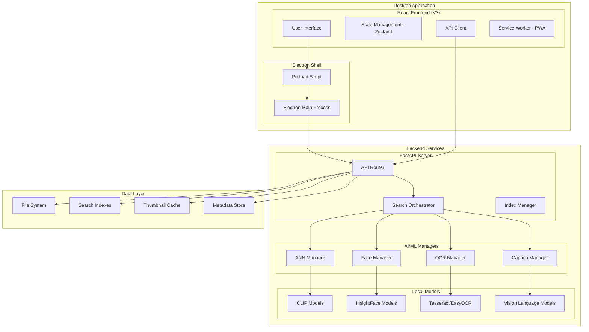
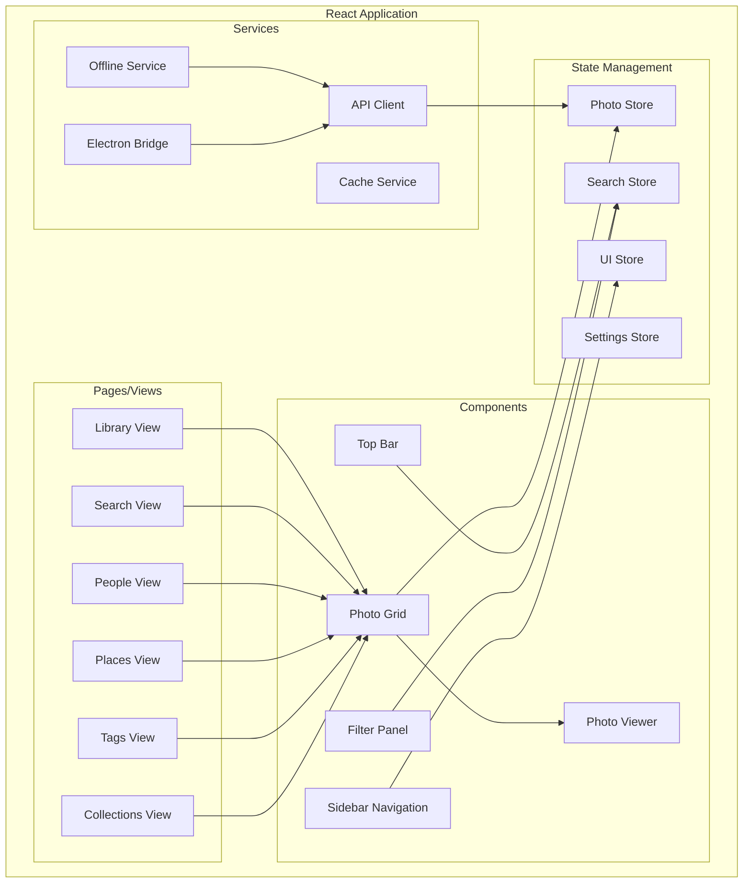
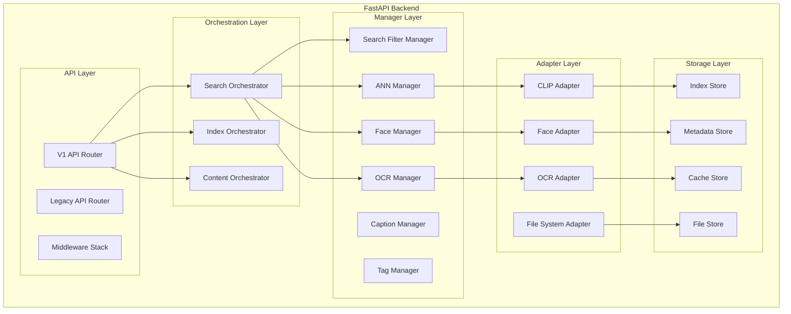

# Photo Management Application V3 - Design Document

## Overview

This design document outlines the architecture for a comprehensive, offline-first photo management application that leverages local AI models for intelligent search and organization. The application is built using modern web technologies (React, TypeScript, Electron) with a FastAPI backend, providing a native desktop experience while maintaining cross-platform compatibility.

The design emphasizes local-first operation with bundled AI models, ensuring user privacy and performance while providing advanced features like semantic search, face recognition, and intelligent organization.

## Architecture

### High-Level Architecture



### Component Architecture

#### Frontend Architecture (React V3)



#### Backend Architecture (FastAPI)



## Components and Interfaces

### Frontend Components

#### 1. Photo Grid Component
**Purpose**: Virtualized display of photo collections with performance optimization

**Interface**:
```typescript
interface PhotoGridProps {
  photos: Photo[];
  onPhotoSelect: (photo: Photo) => void;
  onPhotoToggleFavorite: (photo: Photo) => void;
  viewMode: 'grid' | 'list' | 'timeline';
  selectionMode: boolean;
  selectedPhotos: Set<string>;
  isLoading: boolean;
}

interface Photo {
  id: string;
  path: string;
  thumbnailUrl: string;
  metadata: PhotoMetadata;
  score?: number;
  favorite: boolean;
}
```

**Key Features**:
- Virtualized rendering for 50k+ photos
- Lazy loading with intersection observer
- Multi-selection with keyboard shortcuts
- Responsive grid layout
- Thumbnail quality adaptation

#### 2. Search Interface Component
**Purpose**: Advanced search with filters and real-time suggestions

**Interface**:
```typescript
interface SearchInterfaceProps {
  onSearch: (query: SearchQuery) => void;
  onFilterChange: (filters: SearchFilters) => void;
  suggestions: SearchSuggestion[];
  recentSearches: string[];
  savedSearches: SavedSearch[];
}

interface SearchQuery {
  text: string;
  filters: SearchFilters;
  options: SearchOptions;
}

interface SearchFilters {
  dateRange?: DateRange;
  location?: LocationFilter;
  camera?: CameraFilter;
  people?: string[];
  tags?: string[];
  favorites?: boolean;
  hasText?: boolean;
}
```

**Key Features**:
- Real-time search suggestions
- Advanced filter panel
- Search history and favorites
- Query syntax highlighting
- Progressive search results

#### 3. Photo Viewer Component
**Purpose**: Full-screen photo viewing with metadata and editing

**Interface**:
```typescript
interface PhotoViewerProps {
  photo: Photo;
  photos: Photo[];
  currentIndex: number;
  onNext: () => void;
  onPrevious: () => void;
  onClose: () => void;
  onMetadataEdit: (metadata: Partial<PhotoMetadata>) => void;
}
```

**Key Features**:
- Keyboard navigation
- Zoom and pan controls
- Metadata display and editing
- Slideshow mode
- Sharing and export options

### Backend Components

#### 1. Search Orchestrator
**Purpose**: Coordinate all search operations with unified interface

**Interface**:
```python
class SearchOrchestrator:
    def search(self, request: SearchRequest) -> SearchResponse:
        """Execute comprehensive search with all enabled features"""
        
    def search_similar(self, photo_path: str, limit: int = 20) -> SearchResponse:
        """Find visually similar photos"""
        
    def search_by_face(self, face_id: str, limit: int = 20) -> SearchResponse:
        """Find photos containing specific person"""
        
    def get_search_suggestions(self, partial_query: str) -> List[SearchSuggestion]:
        """Generate real-time search suggestions"""
```

**Key Features**:
- Multi-modal search (semantic, metadata, content)
- Result ranking and scoring
- Performance optimization
- Caching and memoization
- Analytics and monitoring

#### 2. ANN Manager
**Purpose**: Manage multiple approximate nearest neighbor indexes

**Interface**:
```python
class ANNManager:
    def create_index(self, index_type: ANNIndexType, dimension: int) -> str:
        """Create new ANN index"""
        
    def add_vectors(self, index_id: str, vectors: np.ndarray, ids: List[str]) -> bool:
        """Add vectors to index"""
        
    def search_vectors(self, index_id: str, query: np.ndarray, k: int) -> List[Tuple[str, float]]:
        """Search for similar vectors"""
        
    def get_index_status(self, index_id: str) -> IndexStatus:
        """Get index health and statistics"""
```

**Supported Index Types**:
- FAISS (Facebook AI Similarity Search)
- HNSW (Hierarchical Navigable Small World)
- Annoy (Approximate Nearest Neighbors Oh Yeah)
- Brute Force (exact search fallback)

#### 3. Face Manager
**Purpose**: Handle face detection, clustering, and recognition

**Interface**:
```python
class FaceManager:
    def detect_faces(self, image_path: Path) -> List[FaceDetection]:
        """Detect faces in image"""
        
    def extract_embeddings(self, face_regions: List[FaceRegion]) -> np.ndarray:
        """Extract face embeddings"""
        
    def cluster_faces(self, embeddings: np.ndarray) -> List[FaceCluster]:
        """Cluster similar faces"""
        
    def identify_person(self, face_embedding: np.ndarray) -> Optional[PersonIdentification]:
        """Identify person from face embedding"""
```

**Key Features**:
- InsightFace model integration
- Face clustering algorithms
- Person identification and naming
- Privacy-preserving local processing
- Batch processing optimization

#### 4. OCR Manager
**Purpose**: Extract and search text content from images

**Interface**:
```python
class OCRManager:
    def extract_text(self, image_path: Path) -> OCRResult:
        """Extract text from image"""
        
    def search_text(self, query: str, photo_ids: Optional[List[str]] = None) -> List[TextMatch]:
        """Search extracted text content"""
        
    def get_text_statistics(self) -> OCRStatistics:
        """Get OCR processing statistics"""
        
    def batch_process(self, image_paths: List[Path]) -> BatchOCRResult:
        """Process multiple images efficiently"""
```

**Key Features**:
- EasyOCR and Tesseract integration
- Multi-language support
- Text embedding for semantic search
- Caching and performance optimization
- Confidence scoring and validation

## Data Models

### Core Data Models

#### Photo Metadata Model
```typescript
interface PhotoMetadata {
  // File information
  path: string;
  filename: string;
  size: number;
  mimeType: string;
  createdAt: Date;
  modifiedAt: Date;
  
  // EXIF data
  exif: {
    camera?: string;
    lens?: string;
    iso?: number;
    aperture?: number;
    shutterSpeed?: string;
    focalLength?: number;
    flash?: boolean;
    whiteBalance?: string;
    orientation?: number;
  };
  
  // Location data
  location?: {
    latitude: number;
    longitude: number;
    altitude?: number;
    address?: string;
    city?: string;
    country?: string;
  };
  
  // AI-generated data
  ai: {
    embeddings?: number[];
    faces?: FaceDetection[];
    text?: string;
    captions?: string[];
    tags?: string[];
    confidence?: number;
  };
  
  // User data
  user: {
    favorite: boolean;
    tags: string[];
    collections: string[];
    rating?: number;
    notes?: string;
  };
}
```

#### Search Request Model
```python
@dataclass
class SearchRequest:
    # Core parameters
    directory: str
    query: str
    limit: int = 20
    offset: int = 0
    
    # Search features
    features: SearchFeatures
    
    # Filters
    filters: SearchFilters
    
    # Options
    options: SearchOptions

@dataclass
class SearchFeatures:
    use_semantic: bool = True
    use_metadata: bool = True
    use_ocr: bool = False
    use_captions: bool = False
    use_faces: bool = False
    use_similar: bool = False

@dataclass
class SearchFilters:
    date_range: Optional[DateRange] = None
    location: Optional[LocationFilter] = None
    camera: Optional[CameraFilter] = None
    people: Optional[List[str]] = None
    tags: Optional[List[str]] = None
    collections: Optional[List[str]] = None
    favorites_only: bool = False
    has_text: bool = False
    min_rating: Optional[int] = None
```

#### Face Detection Model
```python
@dataclass
class FaceDetection:
    bbox: Tuple[int, int, int, int]  # x, y, width, height
    confidence: float
    embedding: Optional[np.ndarray] = None
    person_id: Optional[str] = None
    person_name: Optional[str] = None
    landmarks: Optional[Dict[str, Tuple[int, int]]] = None
```

### Database Schema

#### SQLite Schema (Metadata Storage)
```sql
-- Photos table
CREATE TABLE photos (
    id TEXT PRIMARY KEY,
    path TEXT UNIQUE NOT NULL,
    filename TEXT NOT NULL,
    size INTEGER,
    mime_type TEXT,
    created_at TIMESTAMP,
    modified_at TIMESTAMP,
    indexed_at TIMESTAMP,
    
    -- EXIF data (JSON)
    exif_data TEXT,
    
    -- Location data
    latitude REAL,
    longitude REAL,
    altitude REAL,
    address TEXT,
    
    -- User data
    favorite BOOLEAN DEFAULT FALSE,
    rating INTEGER,
    notes TEXT,
    
    -- AI data
    has_faces BOOLEAN DEFAULT FALSE,
    has_text BOOLEAN DEFAULT FALSE,
    caption TEXT,
    
    -- Indexes
    INDEX idx_photos_path (path),
    INDEX idx_photos_created (created_at),
    INDEX idx_photos_location (latitude, longitude),
    INDEX idx_photos_favorite (favorite)
);

-- Tags table
CREATE TABLE tags (
    id INTEGER PRIMARY KEY AUTOINCREMENT,
    name TEXT UNIQUE NOT NULL,
    color TEXT,
    created_at TIMESTAMP DEFAULT CURRENT_TIMESTAMP
);

-- Photo tags junction table
CREATE TABLE photo_tags (
    photo_id TEXT,
    tag_id INTEGER,
    PRIMARY KEY (photo_id, tag_id),
    FOREIGN KEY (photo_id) REFERENCES photos(id),
    FOREIGN KEY (tag_id) REFERENCES tags(id)
);

-- Collections table
CREATE TABLE collections (
    id TEXT PRIMARY KEY,
    name TEXT NOT NULL,
    description TEXT,
    created_at TIMESTAMP DEFAULT CURRENT_TIMESTAMP,
    updated_at TIMESTAMP DEFAULT CURRENT_TIMESTAMP,
    
    -- Smart collection rules (JSON)
    rules TEXT,
    is_smart BOOLEAN DEFAULT FALSE
);

-- Face clusters table
CREATE TABLE face_clusters (
    id TEXT PRIMARY KEY,
    person_name TEXT,
    representative_photo_id TEXT,
    photo_count INTEGER DEFAULT 0,
    created_at TIMESTAMP DEFAULT CURRENT_TIMESTAMP,
    updated_at TIMESTAMP DEFAULT CURRENT_TIMESTAMP
);

-- Face detections table
CREATE TABLE face_detections (
    id TEXT PRIMARY KEY,
    photo_id TEXT NOT NULL,
    cluster_id TEXT,
    bbox_x INTEGER,
    bbox_y INTEGER,
    bbox_width INTEGER,
    bbox_height INTEGER,
    confidence REAL,
    embedding BLOB,
    
    FOREIGN KEY (photo_id) REFERENCES photos(id),
    FOREIGN KEY (cluster_id) REFERENCES face_clusters(id)
);
```

## Error Handling

### Frontend Error Handling

#### Error Boundary Component
```typescript
interface ErrorBoundaryState {
  hasError: boolean;
  error?: Error;
  errorInfo?: ErrorInfo;
}

class PhotoAppErrorBoundary extends Component<PropsWithChildren, ErrorBoundaryState> {
  static getDerivedStateFromError(error: Error): ErrorBoundaryState {
    return { hasError: true, error };
  }
  
  componentDidCatch(error: Error, errorInfo: ErrorInfo) {
    // Log error to monitoring service
    this.logError(error, errorInfo);
  }
  
  render() {
    if (this.state.hasError) {
      return <ErrorFallback error={this.state.error} onRetry={this.handleRetry} />;
    }
    
    return this.props.children;
  }
}
```

#### API Error Handling
```typescript
class APIError extends Error {
  constructor(
    public status: number,
    public code: string,
    message: string,
    public details?: any
  ) {
    super(message);
    this.name = 'APIError';
  }
}

async function handleAPIResponse<T>(response: Response): Promise<T> {
  if (!response.ok) {
    const errorData = await response.json().catch(() => ({}));
    throw new APIError(
      response.status,
      errorData.code || 'UNKNOWN_ERROR',
      errorData.message || 'An unknown error occurred',
      errorData.details
    );
  }
  
  return response.json();
}
```

### Backend Error Handling

#### Exception Hierarchy
```python
class PhotoSearchException(Exception):
    """Base exception for photo search application"""
    def __init__(self, message: str, code: str = None, details: dict = None):
        super().__init__(message)
        self.code = code or self.__class__.__name__
        self.details = details or {}

class IndexingException(PhotoSearchException):
    """Raised when indexing operations fail"""
    pass

class SearchException(PhotoSearchException):
    """Raised when search operations fail"""
    pass

class ModelException(PhotoSearchException):
    """Raised when AI model operations fail"""
    pass

class FileSystemException(PhotoSearchException):
    """Raised when file system operations fail"""
    pass
```

#### Error Response Format
```python
@dataclass
class ErrorResponse:
    ok: bool = False
    error: ErrorDetail
    request_id: str
    timestamp: datetime

@dataclass
class ErrorDetail:
    type: str
    message: str
    code: str
    details: Optional[Dict[str, Any]] = None
    suggestions: Optional[List[str]] = None
    help_url: Optional[str] = None
```

#### Global Exception Handler
```python
@app.exception_handler(PhotoSearchException)
async def photo_search_exception_handler(request: Request, exc: PhotoSearchException):
    return JSONResponse(
        status_code=400,
        content=ErrorResponse(
            error=ErrorDetail(
                type=exc.__class__.__name__,
                message=str(exc),
                code=exc.code,
                details=exc.details,
                suggestions=get_error_suggestions(exc),
                help_url=get_help_url(exc.code)
            ),
            request_id=str(uuid.uuid4()),
            timestamp=datetime.utcnow()
        ).dict()
    )
```

## Testing Strategy

### Frontend Testing

#### Component Testing with React Testing Library
```typescript
// PhotoGrid.test.tsx
describe('PhotoGrid Component', () => {
  it('renders photos in virtualized grid', async () => {
    const mockPhotos = generateMockPhotos(1000);
    
    render(
      <PhotoGrid
        photos={mockPhotos}
        onPhotoSelect={jest.fn()}
        onPhotoToggleFavorite={jest.fn()}
        viewMode="grid"
        selectionMode={false}
        selectedPhotos={new Set()}
        isLoading={false}
      />
    );
    
    // Should render initial batch of photos
    expect(screen.getAllByRole('img')).toHaveLength(20);
    
    // Should handle scrolling and load more photos
    fireEvent.scroll(screen.getByTestId('photo-grid'), { target: { scrollTop: 1000 } });
    
    await waitFor(() => {
      expect(screen.getAllByRole('img').length).toBeGreaterThan(20);
    });
  });
  
  it('handles photo selection correctly', () => {
    const mockOnSelect = jest.fn();
    const mockPhotos = generateMockPhotos(10);
    
    render(
      <PhotoGrid
        photos={mockPhotos}
        onPhotoSelect={mockOnSelect}
        onPhotoToggleFavorite={jest.fn()}
        viewMode="grid"
        selectionMode={true}
        selectedPhotos={new Set()}
        isLoading={false}
      />
    );
    
    fireEvent.click(screen.getAllByRole('img')[0]);
    expect(mockOnSelect).toHaveBeenCalledWith(mockPhotos[0]);
  });
});
```

#### Integration Testing with MSW
```typescript
// api.test.tsx
import { rest } from 'msw';
import { setupServer } from 'msw/node';

const server = setupServer(
  rest.post('/api/search', (req, res, ctx) => {
    return res(
      ctx.json({
        results: [
          { path: '/test/photo1.jpg', score: 0.95 },
          { path: '/test/photo2.jpg', score: 0.87 }
        ],
        total: 2,
        query: 'test query'
      })
    );
  })
);

describe('API Integration', () => {
  beforeAll(() => server.listen());
  afterEach(() => server.resetHandlers());
  afterAll(() => server.close());
  
  it('performs search and updates state', async () => {
    const { result } = renderHook(() => usePhotoStore());
    
    await act(async () => {
      await result.current.search('test query');
    });
    
    expect(result.current.photos).toHaveLength(2);
    expect(result.current.photos[0].path).toBe('/test/photo1.jpg');
  });
});
```

### Backend Testing

#### Unit Testing with pytest
```python
# test_search_orchestrator.py
import pytest
from unittest.mock import Mock, patch
from api.orchestrators.search_orchestrator import SearchOrchestrator
from api.models.search import SearchRequest, SearchFeatures

class TestSearchOrchestrator:
    @pytest.fixture
    def orchestrator(self):
        return SearchOrchestrator(base_dir=Path("./test_data"))
    
    @pytest.fixture
    def mock_managers(self):
        with patch.multiple(
            'api.orchestrators.search_orchestrator',
            ANNManager=Mock(),
            OCRManager=Mock(),
            FaceManager=Mock(),
            SearchFilterManager=Mock()
        ) as mocks:
            yield mocks
    
    def test_basic_search(self, orchestrator, mock_managers):
        # Setup
        request = SearchRequest(
            directory="./test_data",
            query="mountain landscape",
            features=SearchFeatures(use_semantic=True)
        )
        
        mock_managers['ANNManager'].return_value.search_vectors.return_value = [
            ("photo1.jpg", 0.95),
            ("photo2.jpg", 0.87)
        ]
        
        # Execute
        response = orchestrator.search(request)
        
        # Assert
        assert len(response.results) == 2
        assert response.results[0].path == "photo1.jpg"
        assert response.results[0].score == 0.95
        assert response.search_time_ms > 0
    
    def test_search_with_filters(self, orchestrator, mock_managers):
        # Setup filters
        request = SearchRequest(
            directory="./test_data",
            query="vacation",
            filters=SearchFilters(
                date_range=DateRange(
                    start=datetime(2023, 1, 1),
                    end=datetime(2023, 12, 31)
                ),
                favorites_only=True
            )
        )
        
        # Mock filter manager
        mock_managers['SearchFilterManager'].return_value.apply_filters.return_value = True
        
        # Execute and assert
        response = orchestrator.search(request)
        assert response.filters_applied > 0
```

#### Performance Testing
```python
# test_performance.py
import pytest
import time
from pathlib import Path

class TestPerformance:
    @pytest.mark.performance
    def test_large_library_search_performance(self):
        """Test search performance with large photo library"""
        orchestrator = SearchOrchestrator(base_dir=Path("./large_test_data"))
        
        # Warm up
        orchestrator.search(SearchRequest(directory="./large_test_data", query="test"))
        
        # Measure search time
        start_time = time.time()
        response = orchestrator.search(SearchRequest(
            directory="./large_test_data",
            query="mountain landscape",
            limit=50
        ))
        search_time = time.time() - start_time
        
        # Assert performance requirements
        assert search_time < 2.0  # Should complete within 2 seconds
        assert len(response.results) <= 50
        assert response.search_time_ms < 2000
    
    @pytest.mark.performance
    def test_concurrent_search_performance(self):
        """Test concurrent search handling"""
        import concurrent.futures
        
        orchestrator = SearchOrchestrator(base_dir=Path("./test_data"))
        
        def perform_search(query):
            return orchestrator.search(SearchRequest(
                directory="./test_data",
                query=query
            ))
        
        queries = ["mountains", "beach", "city", "forest", "sunset"]
        
        start_time = time.time()
        with concurrent.futures.ThreadPoolExecutor(max_workers=5) as executor:
            futures = [executor.submit(perform_search, query) for query in queries]
            results = [future.result() for future in futures]
        total_time = time.time() - start_time
        
        # All searches should complete successfully
        assert len(results) == 5
        assert all(len(result.results) >= 0 for result in results)
        
        # Concurrent execution should be faster than sequential
        assert total_time < 5.0  # Should complete within 5 seconds
```

### End-to-End Testing

#### Electron E2E Testing with Playwright
```typescript
// e2e/photo-management.spec.ts
import { test, expect } from '@playwright/test';
import { ElectronApplication, _electron as electron } from 'playwright';

test.describe('Photo Management E2E', () => {
  let electronApp: ElectronApplication;
  
  test.beforeAll(async () => {
    electronApp = await electron.launch({ args: ['main.js'] });
  });
  
  test.afterAll(async () => {
    await electronApp.close();
  });
  
  test('should load application and display photo library', async () => {
    const window = await electronApp.firstWindow();
    
    // Wait for app to load
    await window.waitForSelector('[data-testid="photo-grid"]');
    
    // Should display sidebar navigation
    await expect(window.locator('[data-testid="sidebar"]')).toBeVisible();
    
    // Should display top bar with search
    await expect(window.locator('[data-testid="search-input"]')).toBeVisible();
    
    // Should display photo grid
    await expect(window.locator('[data-testid="photo-grid"]')).toBeVisible();
  });
  
  test('should perform photo search', async () => {
    const window = await electronApp.firstWindow();
    
    // Enter search query
    await window.fill('[data-testid="search-input"]', 'mountain landscape');
    await window.press('[data-testid="search-input"]', 'Enter');
    
    // Wait for search results
    await window.waitForSelector('[data-testid="search-results"]');
    
    // Should display search results
    const results = await window.locator('[data-testid="photo-item"]').count();
    expect(results).toBeGreaterThan(0);
    
    // Should display search metadata
    await expect(window.locator('[data-testid="search-info"]')).toContainText('mountain landscape');
  });
  
  test('should handle offline functionality', async () => {
    const window = await electronApp.firstWindow();
    
    // Simulate offline mode
    await window.evaluate(() => {
      // Mock navigator.onLine
      Object.defineProperty(navigator, 'onLine', {
        writable: true,
        value: false
      });
      
      // Dispatch offline event
      window.dispatchEvent(new Event('offline'));
    });
    
    // Should display offline indicator
    await expect(window.locator('[data-testid="offline-indicator"]')).toBeVisible();
    
    // Search should still work offline
    await window.fill('[data-testid="search-input"]', 'sunset');
    await window.press('[data-testid="search-input"]', 'Enter');
    
    // Should get results from local index
    await window.waitForSelector('[data-testid="search-results"]');
    const results = await window.locator('[data-testid="photo-item"]').count();
    expect(results).toBeGreaterThan(0);
  });
});
```

This comprehensive design document provides the foundation for implementing a world-class photo management application with advanced AI capabilities, offline-first architecture, and modern user experience. The modular design ensures maintainability, testability, and extensibility for future enhancements.